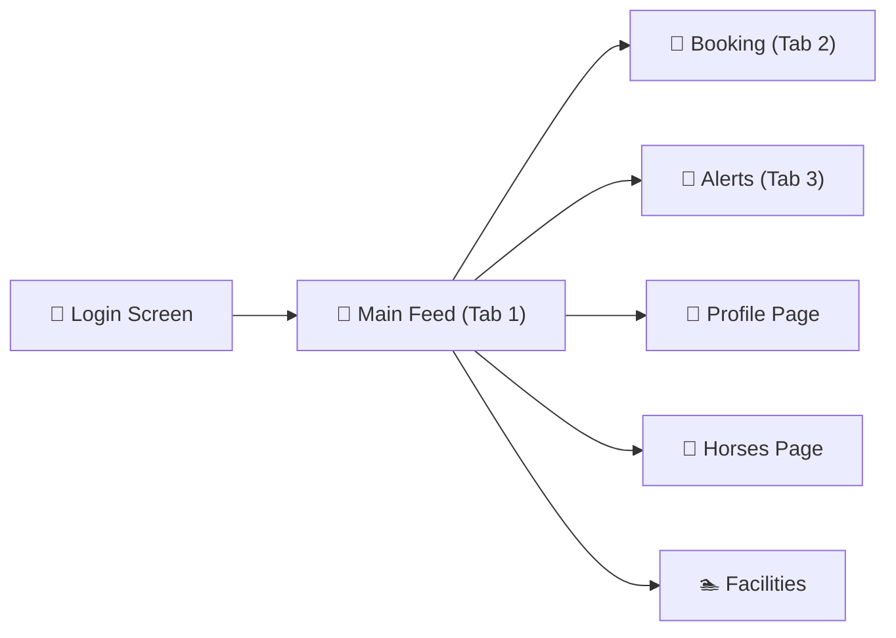

# 🎨 EquiRide — Figma Visual Specification

This document serves as the "Figma" file for the EquiRide project, centralizing the design language, component library, and interactive screen flows.

---

## 🏗 System Architecture & Flow



---

## 🎨 Style Guide (Design Tokens)

````carousel
### 🌑 Color Palette
> **Primary Surfaces & Accents**

| Category | Color | Hex | Rationale |
|----------|-------|-----|-----------|
| **Primary** | Dark Charcoal | `#0F1117` | Premium dark mode foundation |
| **Surface** | Slate Glass | `#1A1D26` | Elevated surfaces with 65% opacity |
| **Accent** | Amber Gold | `#D4A76A` | Luxury brand identity & high-priority CTAs |
| **Alert** | Teal Green | `#2EC4B6` | Success states & secondary actions |
| **Highlight** | Royal Purple | `#7C5CFC` | Tertiary accents & badges |

<!-- slide -->

### ✍️ Typography
> **Inter by Google Fonts**

- **Display 1**: 52px ExtraBold (Hero Titles)
- **Heading 1**: 28px Bold (Page Titles)
- **Heading 2**: 22px SemiBold (Card Titles)
- **Body**: 14px Regular (1.65 line-height)
- **Caption**: 11px Medium (Letter spacing 0.5px)

<!-- slide -->

### 💎 UI Kit: Components
> **Reusable Interactive Elements**

- **GlassCard**: `backdrop-filter: blur(20px)` + `rgba(26,29,38,0.65)`
- **GoldButton**: Linear Gradient `#D4A76A` → `#E8C992`
- **AvatarRing**: 2px Gradient Border with `inner-glow`
- **FeatureChip**: 8px Rounded, Dark Overlay background
````

---

## 📱 High-Fidelity Mockups

````carousel

**Screen 01: Onboarding**
*Cinematic hero with bottom-aligned glassmorphism sign-in module.*

<!-- slide -->


**Screen 02: Community Hub**
*Stories row with active state rings and interactive glass feed cards.*

<!-- slide -->


**Screen 03: Booking Engine**
*Mobile-optimized form with duration chips and floating icon labels.*

<!-- slide -->


**Screen 04: Profile & Navigation**
*Overlaid split-pane menu with categorized explore items and brand versioning.*
````

---

## 🏊 Immersive Assets (Facility Photography)

````carousel

**The Infinity Deck**
*Key visual for the luxury lifestyle vertical.*

<!-- slide -->


**Equine View Suites**
*Hospitality vertical mockup.*

<!-- slide -->


**Equestrian Lounge**
*Social lounge interior spec.*
````

---

## ⚡ UX Flow Summary

1. **User enters** via a cinematic login that sets the "Luxury Club" expectation.
2. **Global Navigation** via a bottom tab bar (Social-first priority) and a deep-dive Side Menu.
3. **Interactions** are consistent across all modules: glass cards for content, gold for actions.
4. **Motion Design** uses staggered entries to reduce perceived load time and guide the eye from top-to-bottom.
